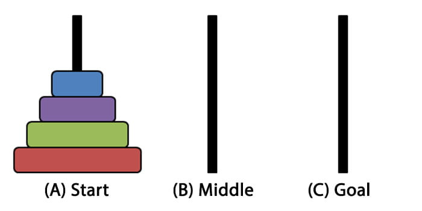

# Torre di Hanoi

>*C'era una volta un magnifico tempio nella
città santa di Benares in India. Ospitava tre
aghi diamantati montati su una piastra.
C'erano anelli d’oro intorno a questi aghi,
ciascuno di diametro variabile ed erano
impilati uno sopra l'altro, in una disposizione
conica. Ai sacerdoti del tempio fu assegnato
il compito di trasferire gli anelli da un ago a
uno qualsiasi degli altri due. Ma dovevano
seguire alcune regole. Non potevano
spostare più di un anello alla volta e non
potevano posizionare un anello su un altro
che fosse più piccolo di circonferenza.
C'erano 64 dischi in totale. Si credeva che
quando i sacerdoti avrebbero terminato
questo compito, il mondo avrebbe
raggiunto la sua fine…*

## Regole del gioco 

Sono previste 3 torri e un numero variabile di dischi disposti come da figura:

L'obiettivo è spostare tutti i dischi nell'ultima torre nello stesso ordine, muovendoli uno alla volta e senza disporre un disco più grande sopra un disco più piccolo.

## Soluzione ricorsiva
La soluzione ricorsiva comporta la seguente complessità computazionale:

- tempo O(2^n)
- spazio O(n)