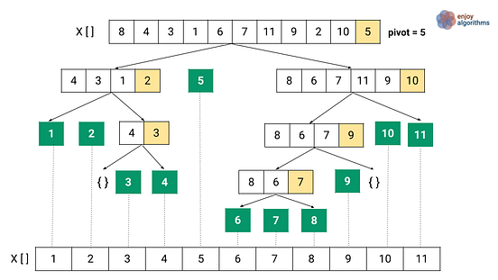

# Algoritmi di ordinamento

In questa sezione vengono trattati due algoritmi di ***ordinamento ricorsivi***:

- MergeSort
- QuickSort

Entrambi gli algoritmi utilizzano un approccio ***divide et impera***.

## MergeSort
L'algoritmo si suddivide in tre step:

1. gli `n` elementi da ordinare vengono suddivisi in due gruppi da `n / 2` elementi.
2. le due sottosequenze vengono riordinate ricorsivamente con l'utilizzo della funzione ***Merge***.
3. le sottosequenze ordinate vengono *combinate* per creare la sequenza originale ordinata.

La seguente figura raffigura l'albero dell'algoritmo:

La complessità computazionale è la seguente:

- tempo O(nlogn)
- spazio O(logn)

## QuickSort
L'algoritmo si suddivide in tre step:

1. viene scelto un elemento(in maniera casuale o l'ultimo) dagli elementi da ordinare.
2. gli elementi < dell'elemento scelto verrano disposti alla sua sinistra, i > sulla destra.
3. si applica ricorsivamente il meccanismo alle sottosequenze che si creano suddividendo gli elementi iniziali.

La seguente figura raffigura l'albero dell'algoritmo:

